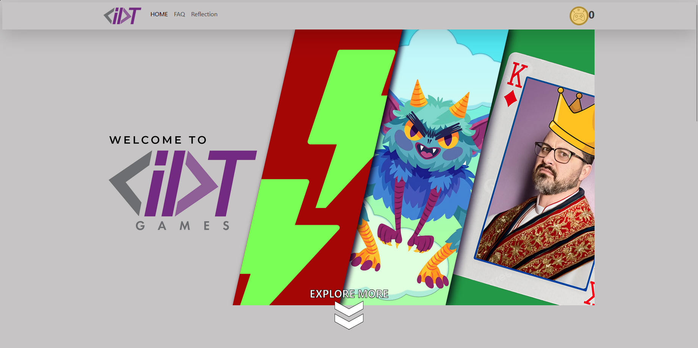
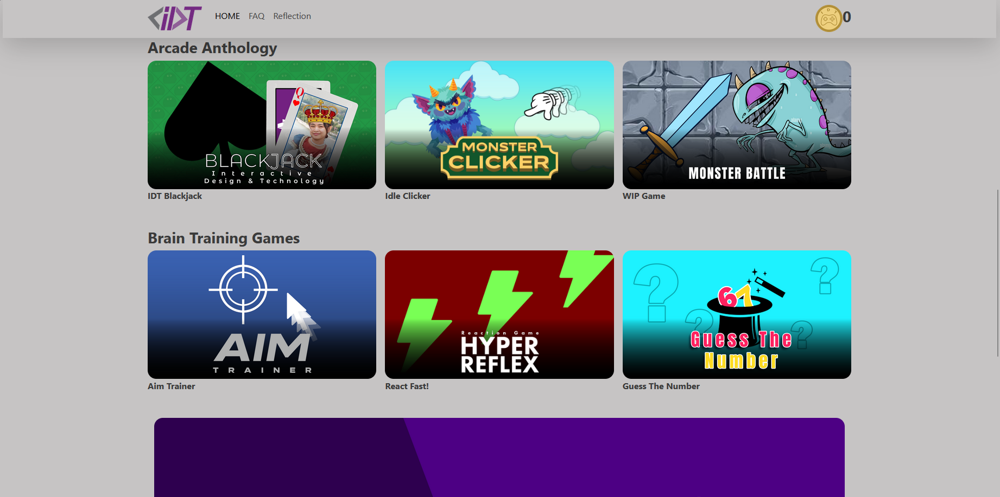
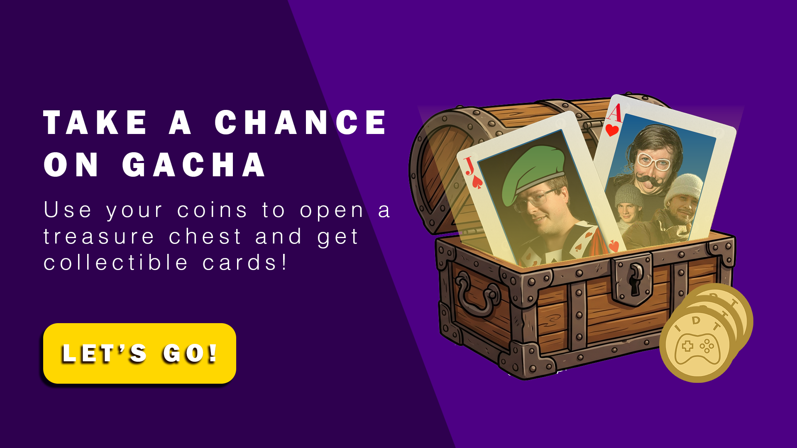

# MULT 128 Assignment 2
My best one yet! I had a lot of fun doing this assignment. I had so many plans for this but got shelved due to time constraints.
 

## Library used in this project
### [Bootstrap]
- Bootstrap is the main framework used in this project
### [Anime JS]
- This is used for animating elements
### [Animate CSS]
- Mainly used for text animation
### [Tailwind CSS]
- Another framework used for blackjack game

## Play games!

## Get Rare cards on Gacha!

## Issues
- There are some issues where Gold data does not load on some browsers. It does not work properly on my chrome but it works on my firefox. If something is broken, try hard resetting by pressing Ctrl + Shift + R OR Shift + F5
